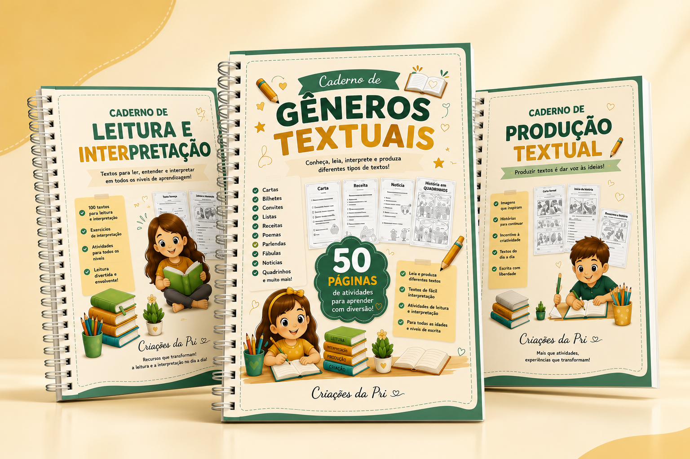

# Correções de fidelidade — Educa Pri (clone Open Design)

Este documento lista, item a item, as divergências entre o site original (React + Tailwind, https://educa-pri.lovable.app) e o clone estático gerado pelo Open Design (https://educa-pri.netlify.app / repositório `educa-pri-open-design`).

Todos os valores marcados como "Valor correto" foram extraídos diretamente do código-fonte original. Aplique cada correção literalmente. Todas as instruções estão em CSS/HTML/JS puro, compatíveis com a arquitetura atual do clone (arquivo único `index.html`, roteamento por hash, páginas montadas por `buildXxx()` e injetadas em `#content`).

Convenção usada abaixo: quando a correção citar `bloco :root`, refere-se ao bloco `:root{...}` no `<style>` do `index.html`. Quando citar "CSS global", adicione a regra ao mesmo `<style>`.

---

## 0. FUNDAÇÃO (afeta todas as páginas)

### Global > Tokens de cor > Variáveis ausentes
- **Onde:** bloco `:root` do `<style>` em `index.html`
- **Fonte real (projeto original):** `src/index.css`, bloco `:root` (linhas 8–76)
- **Valor correto:** o original declara 10 tokens que não existem no clone e são referenciados por componentes:
```css
--surface-alt: 42 55% 94%;
--secondary: 38 88% 55%;
--secondary-foreground: 30 40% 18%;
--cta-foreground: 0 0% 100%;
--cta-soft: 38 100% 92%;
--gold-soft: 44 95% 72%;
--muted: 40 30% 94%;
--muted-foreground: 220 12% 48%;
--input: 40 30% 86%;
--ring: 148 55% 42%;
--radius: 1rem;
```
- **Valor atual no clone (Open Design):** ausentes. `--surface-alt` é usado em `hsl(var(--surface-alt))` (seção "Para quem", listas do TDAH, caixa final de Contato) sem estar declarado, o que resolve para cor inválida/transparente.
- **Correção a aplicar:** adicionar os 11 declarações acima dentro do bloco `:root` existente, sem remover nenhuma das atuais.

### Global > Tokens de cor > Valores confirmados (não alterar)
- **Onde:** bloco `:root`
- **Fonte real (projeto original):** `src/index.css` linhas 10–75
- **Valor correto:** `--background/--bg: 40 60% 97%`, `--surface: 0 0% 100%`, `--surface-warm: 38 70% 92%`, `--ink/--fg: 220 22% 22%`, `--ink-muted: 220 14% 46%`, `--ink-soft: 220 10% 60%`, `--border: 40 30% 86%`, `--primary: 148 55% 42%`, `--primary-hover: 148 60% 36%`, `--cta: 32 94% 52%`, `--cta-hover: 27 90% 46%`, `--gold: 40 90% 55%`, `--gold-deep: 34 78% 45%`, `--highlight: 50 100% 72%`, `--accent: 148 45% 92%`, `--accent-fg/--accent-foreground: 148 55% 28%`, `--brand-blue: 218 75% 42%`, `--brand-pink: 340 82% 72%`, e as cinco sombras `--shadow-xs` a `--shadow-xl`.
- **Valor atual no clone (Open Design):** idênticos.
- **Correção a aplicar:** nenhuma. Manter exatamente como está. Ignore a tabela OKLch do `brand-spec.md`: a fonte de verdade é HSL, e o `brand-spec.md` deve ser atualizado para remover a coluna OKLch, que é uma aproximação e não o valor real.

### Global > Escala de border-radius > Valores dos utilitários de raio
- **Onde:** todos os cards de ícone, caixas arredondadas e links do menu mobile
- **Fonte real (projeto original):** `tailwind.config.ts`, `theme.extend.borderRadius` — a escala padrão do Tailwind foi **sobrescrita** no projeto:
```
xs = 0.375rem (6px)
sm = 0.625rem (10px)
md = 0.875rem (14px)
lg = 1.25rem  (20px)
xl = 1.75rem  (28px)
2xl = 2.25rem (36px)
3xl = 1.5rem  (24px, valor padrão, não sobrescrito)
```
- **Valor atual no clone (Open Design):** o clone assumiu a escala padrão do Tailwind (12px para `xl`, 16px para `2xl`, 8px para `lg`), o que deixa todos os quadrados de ícone e caixas visivelmente menos arredondados que no original.
- **Correção a aplicar:** substituir globalmente no `index.html`:
  - quadrados de ícone 48×48 (`border-radius:12px`) → `border-radius:28px`
  - caixas de área/categoria (`border-radius:16px`) → `border-radius:36px`
  - links do menu mobile (`border-radius:8px`) → `border-radius:20px`
  - manter `border-radius:24px` nas caixas grandes (`rounded-3xl`) e `1.25rem` nos `.card-sticker`.

### Global > Tipografia > Pesos e tracking dos títulos
- **Onde:** regra `h1,h2,h3,h4` no CSS global
- **Fonte real (projeto original):** `src/index.css` linha 115 — `h1,h2,h3,h4 { @apply font-poppins tracking-tight; }`. O `tracking-tight` do Tailwind é `-0.025em`.
- **Valor correto:** `letter-spacing:-0.025em`
- **Valor atual no clone (Open Design):** `h1,h2,h3,h4{font-family:Poppins,system-ui,sans-serif;letter-spacing:-0.01em}`
- **Correção a aplicar:** trocar para `h1,h2,h3,h4{font-family:Poppins,system-ui,sans-serif;letter-spacing:-0.025em}`

### Global > Tipografia > line-height do corpo
- **Onde:** regra `body`
- **Fonte real (projeto original):** `src/index.css` linhas 111–114. O `body` não define `line-height`; o Tailwind aplica `1.5` como padrão e cada elemento define o seu (`leading-relaxed` = 1.625, `leading-tight` = 1.25, `leading-snug` = 1.375).
- **Valor correto:** `line-height:1.5` no `body`
- **Valor atual no clone (Open Design):** `line-height:1.6`
- **Correção a aplicar:** em `body{...}`, trocar `line-height:1.6` por `line-height:1.5`.

### Global > Sistema de botões > Valores confirmados (não alterar)
- **Onde:** classes `.btn`, `.btn-sm`, `.btn-md`, `.btn-lg`, `.btn-primary`, `.btn-secondary`, `.btn-outline`, `.btn-whatsapp`
- **Fonte real (projeto original):** `src/components/site/Button.tsx` (base, `sizes`, `variants`) e `src/index.css` (`.btn-shine`, `pulse-gold`, `pulse-soft`)
- **Valor correto:** `border-radius:9999px`, Poppins 600, `transition:all .2s`; sm `14px / 8px 16px / min-height:40px`; md `16px / 12px 24px / min-height:48px`; lg `16px→18px em ≥640px / 16px 28px / min-height:56px`; hover de primary/whatsapp com `translateY(-2px)` e `--shadow-lg`; brilho `::after` com `left:-120% → 130%`, `skewX(-18deg)`, `transition:left .6s ease`; `pulse-gold` e `pulse-soft` em `2.6s ease-in-out infinite`.
- **Valor atual no clone (Open Design):** idêntico, **exceto o tamanho de fonte do `btn-lg`** (ver item abaixo).
- **Correção a aplicar:** manter tudo, aplicando apenas a correção do `btn-lg`.

### Global > Sistema de botões > Tamanho de fonte do botão grande
- **Onde:** `.btn-lg`
- **Fonte real (projeto original):** `src/components/site/Button.tsx`, `sizes.lg` = `"text-base sm:text-lg px-7 py-4 min-h-[56px]"` — ou seja, 16px no mobile e **18px a partir de 640px**.
- **Valor correto:**
```css
.btn-lg{font-size:16px;padding:16px 28px;min-height:56px}
@media(min-width:640px){.btn-lg{font-size:18px}}
```
- **Valor atual no clone (Open Design):** `.btn-lg{font-size:16px;padding:16px 28px;min-height:56px}` — fixo em 16px em todos os breakpoints.
- **Correção a aplicar:** adicionar a media query acima logo após a regra `.btn-lg`.

### Global > Acessibilidade > Foco visível ausente
- **Onde:** todos os botões, links de CTA, `.back-link`, FAB, cards clicáveis, gatilhos do acordeão
- **Fonte real (projeto original):** `src/index.css`, `.btn-focus` — `focus-visible:ring-2 ring-[hsl(var(--ring))] ring-offset-2 ring-offset-[hsl(var(--background))]` e `outline:none`.
- **Valor correto:**
```css
.btn:focus-visible,
.back-link:focus-visible,
.card-sticker:focus-visible,
.accordion-trigger:focus-visible,
#whatsapp-fab:focus-visible,
.nav-item:focus-visible,
.mob-link:focus-visible{
  outline:none;
  box-shadow:0 0 0 2px hsl(var(--bg)), 0 0 0 4px hsl(148 55% 42%);
}
```
- **Valor atual no clone (Open Design):** nenhuma regra de `:focus-visible` no arquivo. Navegação por teclado fica sem indicação visual.
- **Correção a aplicar:** adicionar o bloco CSS acima ao `<style>` global.

### Global > Animações > `prefers-reduced-motion` incompleto
- **Onde:** bloco `@media(prefers-reduced-motion:reduce)` do CSS
- **Fonte real (projeto original):** `src/index.css` linhas 271–280 — além do que o clone já cobre, o original também neutraliza `.reveal-blur`, `.tilt-3d-inner` e `.hover-lift`.
- **Valor correto:**
```css
@media(prefers-reduced-motion:reduce){
  .animate-float,.animate-float-slow,.animate-float-mock,.animate-wiggle,
  .btn-pulse-whatsapp,.btn-pulse-gold{animation:none!important}
  .mockup-3d,.tilt-3d-inner{transform:none!important;transition:none!important}
  .hover-lift{transition:none!important}
  .reveal,.reveal-left,.reveal-right,.reveal-zoom,.reveal-blur{
    opacity:1!important;transform:none!important;filter:none!important;transition:none!important}
}
```
- **Valor atual no clone (Open Design):** não cobre `.reveal-blur`, `.tilt-3d-inner` nem `.hover-lift`, e não zera `transition` do `.mockup-3d`.
- **Correção a aplicar:** substituir o bloco atual pelo acima.

### Global > Animações > Variante de revelação `.reveal-blur` ausente
- **Onde:** CSS global
- **Fonte real (projeto original):** `src/index.css` linhas 260–261 e `src/components/site/Reveal.tsx` (`variant="blur"`)
- **Valor correto:**
```css
.reveal-blur{opacity:0;filter:blur(8px);transform:translateY(18px);
  transition:opacity .6s ease-out,filter .6s ease-out,transform .6s ease-out}
.reveal-blur.is-visible{opacity:1;filter:blur(0);transform:none}
@media(max-width:640px){.reveal-blur{filter:none}}
```
- **Valor atual no clone (Open Design):** classe inexistente.
- **Correção a aplicar:** adicionar o bloco acima ao CSS global.

### Global > Animações > Easing das revelações
- **Onde:** `.reveal`, `.reveal-left`, `.reveal-right`, `.reveal-zoom`, `.hover-lift`, `.mockup-3d`, `.card-shine`
- **Fonte real (projeto original):** `src/index.css` linhas 194, 254–259, 268, 237, 229
- **Valor correto:**
```css
.reveal{transition:opacity .55s ease-out,transform .55s ease-out}
.reveal-left,.reveal-right{transition:opacity .6s ease-out,transform .6s ease-out}
.reveal-zoom{transition:opacity .55s ease-out,transform .55s cubic-bezier(.2,.8,.25,1)}
.hover-lift{transition:transform .3s cubic-bezier(.2,.8,.25,1),box-shadow .3s ease}
.mockup-3d{transition:transform .6s cubic-bezier(.2,.8,.25,1),filter .6s ease}
.card-shine{transition:background-position .8s ease}
```
- **Valor atual no clone (Open Design):** todas essas transições estão sem função de easing declarada (`transition:opacity .55s,transform .55s`), o que faz o navegador usar `ease` em vez de `ease-out`/`cubic-bezier`.
- **Correção a aplicar:** acrescentar os easings exatos acima em cada regra.

### Global > Animações > Efeito 3D `tilt-3d` ausente nos cards de produto
- **Onde:** cards de produto (Home e Produtos)
- **Fonte real (projeto original):** `src/index.css` linhas 219–223 e `src/components/site/ProductCard.tsx` (classes `tilt-3d` no link e `tilt-3d-inner` na imagem)
- **Valor correto:**
```css
.tilt-3d{transform-style:preserve-3d;perspective:1000px}
.tilt-3d-inner{transition:transform .5s cubic-bezier(.2,.8,.25,1);will-change:transform}
@media (hover:hover) and (min-width:768px){
  .tilt-3d:hover .tilt-3d-inner{transform:rotateY(-8deg) rotateX(5deg) translateZ(28px) scale(1.06)}
}
```
- **Valor atual no clone (Open Design):** inexistente. A imagem do card usa apenas `onmouseover="this.style.transform='scale(1.06)'"`, sem rotação 3D e sem o guard de `hover:hover`/desktop.
- **Correção a aplicar:** adicionar o CSS acima; no `productCard()`, colocar `class="... tilt-3d"` no `<a>`, `class="tilt-3d-inner"` na `` e **remover** os atributos `onmouseover`/`onmouseout` da imagem.

### Global > Animações > `mockup-3d` sem guard de hover no desktop
- **Onde:** heros das páginas de produto
- **Fonte real (projeto original):** `src/index.css` linhas 240–242
- **Valor correto:**
```css
@media (hover:hover) and (min-width:768px){
  .mockup-3d:hover{transform:perspective(1200px) rotateY(0deg) rotateX(0deg) translateY(-8px) scale(1.03)}
}
```
- **Valor atual no clone (Open Design):** o estado de hover do `.mockup-3d` não existe — o mockup fica estático em `rotateY(-9deg) rotateX(4deg)` mesmo no desktop.
- **Correção a aplicar:** adicionar a media query acima.

### Global > Animações > `card-shine` sem gatilho de hover nos heros de produto
- **Onde:** overlay de brilho dentro da moldura do mockup (páginas de produto)
- **Fonte real (projeto original):** `src/index.css` linhas 225–232 + `ProductKit.tsx`/`ProductTdah.tsx`, onde a moldura tem a classe `group` e o overlay a classe `card-shine`
- **Valor correto:** o overlay precisa animar de `background-position:130% 0` para `-30% 0` quando o contêiner pai (`.group`) recebe hover.
- **Valor atual no clone (Open Design):** o overlay é gerado com estilos inline e sem a classe `card-shine`, e a moldura não tem a classe `group` — o brilho nunca é acionado.
- **Correção a aplicar:** no `buildProductDetail()`, trocar o `<span>` do overlay por `<span aria-hidden class="card-shine" style="position:absolute;inset:0;pointer-events:none"></span>` e adicionar `class="group"` na `<div>` da moldura do mockup.

### Global > Animações > BUG CRÍTICO: elementos `.reveal-left` nunca ficam visíveis
- **Onde:** função `observeReveal()` no `<script>`
- **Fonte real (projeto original):** `src/components/site/Reveal.tsx` — o observer é anexado a cada elemento revelável, qualquer que seja a variante.
- **Valor correto:** o seletor precisa cobrir todas as variantes:
```js
document.querySelectorAll('.reveal, .reveal-left, .reveal-right, .reveal-zoom, .reveal-blur, .reveal-cascade > .card-sticker')
```
- **Valor atual no clone (Open Design):** `document.querySelectorAll('.reveal, .reveal-cascade > .card-sticker')`. Como `.reveal-left` é uma classe distinta (não casa com `.reveal`), o bloco do mockup nos heros das páginas `#/produtos/kit-cadernos` e `#/produtos/manual-tdah` permanece em `opacity:0` para sempre — **a imagem do produto está invisível no clone**.
- **Correção a aplicar:** substituir o seletor dentro de `observeReveal()` pela lista completa acima.

### Global > Animações > Cascata escalonada aplicada a grades erradas
- **Onde:** classe `.reveal-cascade`
- **Fonte real (projeto original):** os delays escalonados existem apenas na grade de diferenciais da Home (`src/pages/Home.tsx` linha 85: `delay={(i % 3) * 90}`) — **90ms por item, reiniciando a cada 3 itens**, e a variante é `zoom`, não `up`.
- **Valor correto:**
```css
.reveal-cascade > .card-sticker{opacity:0;transform:scale(.94);
  transition:opacity .55s ease-out,transform .55s cubic-bezier(.2,.8,.25,1)}
.reveal-cascade > .card-sticker.is-visible{opacity:1;transform:none}
.reveal-cascade > .card-sticker:nth-child(3n+1){transition-delay:0ms}
.reveal-cascade > .card-sticker:nth-child(3n+2){transition-delay:90ms}
.reveal-cascade > .card-sticker:nth-child(3n+3){transition-delay:180ms}
```
- **Valor atual no clone (Open Design):** translação vertical de 14px com delays de 100ms acumulando até 500ms (`nth-child(1)`…`nth-child(6)`), aplicada também às grades de produtos (`#prod-grid`, `#home-prod-grid`), onde o original não usa cascata.
- **Correção a aplicar:** substituir o bloco `.reveal-cascade` pelo acima e **remover a classe `reveal-cascade`** de `#prod-grid` e `#home-prod-grid` (nessas grades os cards usam `reveal-left` no 1º e `reveal-right` no 2º — ver item da seção Produtos).

### Global > Header > Tamanho do logo em telas ≥640px
- **Onde:** ``
- **Fonte real (projeto original):** `src/components/site/Header.tsx` linha 15 — `compact ? "w-10 h-10" : "w-12 h-12 sm:w-14 sm:h-14"`
- **Valor correto:** topo da página: **48px** no mobile e **56px a partir de 640px**; rolado (`scrollY > 8`): **40px** em qualquer largura.
- **Valor atual no clone (Open Design):** 48px fixo no estado padrão (o JS só alterna entre `48px` e `40px`), nunca chegando a 56px.
- **Correção a aplicar:** no handler de scroll, trocar por:
```js
var big = window.innerWidth >= 640 ? '56px' : '48px';
if (logo){ logo.style.width = s ? '40px' : big; logo.style.height = s ? '40px' : big; }
```

### Global > Header > Anel dourado do logo
- **Onde:** `` e logo do rodapé
- **Fonte real (projeto original):** `Header.tsx` usa `ring-2 ring-gold/40` (anel **externo** de 2px, hover `ring-gold`); `Footer.tsx` usa `ring-2 ring-gold/50`.
- **Valor correto:** `box-shadow:0 0 0 2px hsl(var(--gold)/0.4)` no header (e `0 0 0 2px hsl(var(--gold)/0.5)` no rodapé), com `box-shadow:0 0 0 2px hsl(var(--gold))` no hover do header.
- **Valor atual no clone (Open Design):** `outline:2px solid hsl(var(--gold)/0.4);outline-offset:-2px` — o anel fica **por dentro** da imagem, cobrindo a borda do logo, e não há estado de hover.
- **Correção a aplicar:** trocar `outline`/`outline-offset` pelo `box-shadow` acima e adicionar:
```css
header a:hover #h-logo{box-shadow:0 0 0 2px hsl(var(--gold))}
```

### Global > Header > Transição do header
- **Onde:** `.header`
- **Fonte real (projeto original):** `Header.tsx` usa `transition-all` (padrão Tailwind: `150ms cubic-bezier(0.4,0,0.2,1)`) e `backdrop-blur` = `blur(8px)`.
- **Valor correto:** `transition:all .15s cubic-bezier(0.4,0,0.2,1); backdrop-filter:blur(8px)`
- **Valor atual no clone (Open Design):** `transition:.3s; backdrop-filter:blur(12px)`
- **Correção a aplicar:** atualizar a regra `.header` com os dois valores acima.

### Global > Header > Menu mobile sem borda arredondada correta e sem transição
- **Onde:** `.mob-link`
- **Fonte real (projeto original):** `Header.tsx` linha 97 — `px-4 py-3 rounded-lg text-base font-semibold`, com `rounded-lg` = **1.25rem (20px)** nesta configuração, e estado ativo `bg-accent text-primary`, hover `bg-surface-alt`.
- **Valor correto:** `border-radius:20px`; ativo: `background:hsl(var(--accent));color:hsl(var(--primary))`; hover: `background:hsl(var(--surface-alt))`.
- **Valor atual no clone (Open Design):** `border-radius:8px`, sem estado ativo e sem hover.
- **Correção a aplicar:** ajustar o `border-radius` inline de cada `.mob-link` para `20px` e adicionar:
```css
.mob-link:hover{background:hsl(var(--surface-alt))}
.mob-link.active{background:hsl(var(--accent));color:hsl(var(--primary))}
```
No `route()`, replicar a lógica de `.nav-item` para `.mob-link` (adicionar/remover a classe `active` conforme `data-route === hash`).

### Global > Header > Estado hover dos links de navegação desktop
- **Onde:** `.nav-item`
- **Fonte real (projeto original):** `Header.tsx` linha 63 — inativo: `text-ink hover:text-primary hover:bg-surface-alt`; ativo: `bg-accent text-primary`.
- **Valor correto:**
```css
.nav-item{transition:color .15s,background-color .15s}
.nav-item:hover:not(.active){color:hsl(var(--primary));background:hsl(var(--surface-alt))}
```
- **Valor atual no clone (Open Design):** não há regra `.nav-item` no CSS; só o estado ativo é aplicado por JS inline. Não existe hover.
- **Correção a aplicar:** adicionar o CSS acima e, no `route()`, marcar o item ativo com `classList.add('active')` além do estilo inline.

### Global > WhatsApp FAB > Tamanho, posição e pulso
- **Onde:** `#whatsapp-fab`
- **Fonte real (projeto original):** `src/components/site/WhatsAppFab.tsx` linhas 17 e 26 — `bottom-5 right-5 sm:bottom-7 sm:right-7`; círculo `w-14 h-14 sm:w-16 sm:h-16`; ícone `w-7 h-7 sm:w-8 sm:h-8`; `animate-pulse-soft`; `hover:bg-primary-hover`; `hover:scale-105`.
- **Valor correto:**
```css
#whatsapp-fab{position:fixed;bottom:20px;right:20px}
@media(min-width:640px){#whatsapp-fab{bottom:28px;right:28px}}
#whatsapp-fab .pulse-el{width:56px;height:56px;animation:pulse-soft 2.6s ease-in-out infinite;
  transition:transform .15s,background-color .15s}
#whatsapp-fab:hover .pulse-el{transform:scale(1.05);background:hsl(var(--primary-hover))}
@media(min-width:640px){#whatsapp-fab .pulse-el{width:64px;height:64px}
  #whatsapp-fab .pulse-el svg{width:32px;height:32px}}
```
- **Valor atual no clone (Open Design):** `bottom:20px;right:20px` fixo; círculo 56px fixo; a classe `pulse-el` está no HTML mas **não existe no CSS**, então não há pulso; não há hover.
- **Correção a aplicar:** adicionar o bloco CSS acima.

### Global > WhatsApp FAB > Tooltip
- **Onde:** `#fab-tip`
- **Fonte real (projeto original):** `WhatsAppFab.tsx` linhas 19–25 — o tooltip é sempre renderizado (`hidden sm:block`) e faz transição de `opacity-0 translate-x-2` para `opacity-100 translate-x-0` em `200ms`; também aparece em `focus`.
- **Valor correto:**
```css
#fab-tip{display:none;opacity:0;transform:translateX(8px);
  transition:opacity .2s,transform .2s;pointer-events:none}
@media(min-width:640px){#fab-tip{display:block}}
#whatsapp-fab:hover #fab-tip,#whatsapp-fab:focus-visible #fab-tip{opacity:1;transform:translateX(0)}
```
- **Valor atual no clone (Open Design):** alternância abrupta de `display:none`/`block` via `onmouseenter`/`onmouseleave` em JS, sem transição e sem resposta ao foco por teclado.
- **Correção a aplicar:** aplicar o CSS acima e **remover** os handlers `fab.onmouseenter` / `fab.onmouseleave` do script.

### Global > Espaçamento e layout > Padding vertical das seções
- **Onde:** todas as `<section>` de conteúdo, em todas as páginas
- **Fonte real (projeto original):** `src/index.css` linha 148 — `.section-y { @apply py-16 sm:py-20 lg:py-24; }` = **64px / 80px / 96px**.
- **Valor correto:**
```css
.section-y{padding-top:64px;padding-bottom:64px}
@media(min-width:640px){.section-y{padding-top:80px;padding-bottom:80px}}
@media(min-width:1024px){.section-y{padding-top:96px;padding-bottom:96px}}
```
- **Valor atual no clone (Open Design):** `padding:64px 0` fixo em todas as seções, sem escalonar por breakpoint. No desktop as seções ficam 32px mais apertadas do que no original.
- **Correção a aplicar:** criar a classe `.section-y` acima e substituir `style="padding:64px 0;..."` por `class="section-y" style="..."` em todas as seções de conteúdo (Home: diferenciais, sobre-home, produtos-home, para-quem; Sobre: missão, citação, áreas; Produtos: grid, em-breve; produto: cadernos, tópicos, para-quem, descrição; FAQ: acordeão; Contato: canais).

### Global > Espaçamento e layout > Bloco de título de seção
- **Onde:** `.section-title` e o contêiner do título de seção
- **Fonte real (projeto original):** `src/components/site/Section.tsx` linhas 47 e 54 — contêiner `max-w-2xl mb-10 sm:mb-14`; `<h2>` = `text-3xl sm:text-4xl lg:text-[2.6rem] font-extrabold leading-tight` = **30px / 36px / 41.6px**, `line-height:1.25`.
- **Valor correto:**
```css
.section-title{font-size:30px;font-weight:800;line-height:1.25}
@media(min-width:640px){.section-title{font-size:36px}}
@media(min-width:1024px){.section-title{font-size:2.6rem}}
.section-head{max-width:42rem;margin-bottom:40px}
@media(min-width:640px){.section-head{margin-bottom:56px}}
```
- **Valor atual no clone (Open Design):** `.section-title{font-size:clamp(1.75rem,4vw,2.6rem);line-height:1.2}` e contêineres com `margin:0 auto 40px` fixo. No mobile o título fica em 28px em vez de 30px e a margem inferior não cresce em telas ≥640px.
- **Correção a aplicar:** substituir a regra `.section-title` pela acima e adicionar `class="section-head"` (mantendo `margin-left:auto;margin-right:auto` quando centralizado) nos contêineres de título, removendo o `margin-bottom:40px` inline.

### Global > Roteamento > Transição entre páginas
- **Onde:** função `route()`
- **Fonte real (projeto original):** `src/components/site/SiteLayout.tsx` — a troca de rota faz `window.scrollTo({ top: 0, behavior: "auto" })` e o conteúdo novo é montado sem transição de saída; cada bloco entra pela animação de scroll reveal do `IntersectionObserver` (threshold `0.12`, rootMargin `0px 0px -40px 0px`).
- **Valor correto:** o comportamento do clone está correto na intenção. O único ajuste necessário é garantir que o `IntersectionObserver` seja religado a **todas** as variantes de reveal após a troca de rota (ver o item "BUG CRÍTICO" acima) e que o `setTimeout(..., 10)` continue após o `innerHTML`.
- **Valor atual no clone (Open Design):** `window.scrollTo(0,0)` + `main.innerHTML = pageFn()` + `setTimeout(...,10)`.
- **Correção a aplicar:** manter, aplicando somente a correção do seletor de `observeReveal()`. Não adicionar fade de página: o original não tem transição de rota.

### Global > Meta/SEO > Tags ausentes no `<head>`
- **Onde:** `<head>` do `index.html`
- **Fonte real (projeto original):** `index.html` (linhas 6–19) e `src/components/site/Seo.tsx`
- **Valor correto:**
```html
<meta name="description" content="Educa Pri: materiais pedagógicos digitais para alfabetização, leitura, produção textual e apoio a crianças com TDAH. Feitos com carinho para professores, famílias e terapeutas.">
<meta name="author" content="Educa Pri — Criações da Pri">
<meta name="theme-color" content="#2f9e5f">
<meta property="og:type" content="website">
<meta property="og:title" content="Educa Pri — Materiais pedagógicos feitos com amor para ensinar">
<meta property="og:description" content="Recursos digitais para alfabetização, leitura, produção textual e apoio a crianças com TDAH.">
<meta name="twitter:card" content="summary_large_image">
<meta name="twitter:title" content="Educa Pri — Materiais pedagógicos feitos com amor para ensinar">
<meta name="twitter:description" content="Recursos digitais para alfabetização, leitura, produção textual e apoio a crianças com TDAH.">
<link rel="canonical" href="https://educa-pri.netlify.app/">
```
- **Valor atual no clone (Open Design):** só existem `<title>` e uma `<meta name="description" content="Recursos digitais para alfabetização, leitura, produção textual e TDAH.">` — texto encurtado e diferente do original. Não há `theme-color`, `author`, nenhuma tag Open Graph, nenhuma tag Twitter e nenhuma canonical.
- **Correção a aplicar:** substituir a `meta description` pelo texto correto acima e adicionar todas as demais tags ao `<head>`.

### Global > Meta/SEO > Atualização de og/twitter na troca de rota
- **Onde:** função `route()`, bloco `var meta = {...}`
- **Fonte real (projeto original):** `src/components/site/Seo.tsx` — a cada rota são atualizados `title`, `description`, `canonical`, `og:title`, `og:description`, `og:url`, `twitter:title`, `twitter:description`.
- **Valor correto:** ao trocar de rota, além de `document.title` e da `meta description`, atualizar:
```js
function setMeta(sel, val){ var el=document.querySelector(sel); if(el) el.setAttribute('content', val); }
setMeta('meta[property="og:title"]', m.title);
setMeta('meta[property="og:description"]', m.desc);
setMeta('meta[name="twitter:title"]', m.title);
setMeta('meta[name="twitter:description"]', m.desc);
var can = document.querySelector('link[rel="canonical"]'); if(can) can.setAttribute('href', location.origin + '/#' + hash);
```
- **Valor atual no clone (Open Design):** só `document.title` e `meta[name="description"]`.
- **Correção a aplicar:** inserir o trecho acima dentro do `if (m) {...}`.

### Global > Meta/SEO > Título e descrição da rota de Contato
- **Onde:** objeto `meta` em `route()`, chave `/contato`
- **Fonte real (projeto original):** `src/pages/Contact.tsx` linhas 14–16
- **Valor correto:** `desc = "Fale com a Educa Pri pelo WhatsApp ou Instagram. Estamos aqui para conversar com carinho sobre nossos materiais."`
- **Valor atual no clone (Open Design):** `"Entre em contato com a Educa Pri pelo WhatsApp ou Instagram. Adoramos ouvir professores, famílias e terapeutas."`
- **Correção a aplicar:** substituir a string de `desc` da chave `/contato` pelo texto correto.

### Global > Meta/SEO > 404 sem descrição
- **Onde:** ramo `if (!pageFn)` em `route()`
- **Fonte real (projeto original):** `src/pages/NotFound.tsx` linha 13 — título `"Página não encontrada — Educa Pri"`, descrição `"Ops! Essa página não existe. Vamos voltar para o início?"`
- **Valor correto:** título e descrição acima.
- **Valor atual no clone (Open Design):** `document.title = '404 — Educa Pri'` e a descrição da rota anterior permanece.
- **Correção a aplicar:** trocar o título e atualizar também a `meta description` no ramo do 404.

### Global > Conteúdo e copy > Acentuação removida em todo o site
- **Onde:** textos gerados dentro do `<script>` (arrays `items`, `topics`, `fw`, `fw2`, `cadernos`, strings de FAQ e heros)
- **Fonte real (projeto original):** `src/lib/site.ts` e `src/pages/*.tsx`
- **Valor correto → valor atual no clone:**

| Correto (original) | Atual no clone |
|---|---|
| Criações da Pri | Criacoes da Pri (badge do hero e rodapé) |
| famílias | familias (hero da Home, Produtos, Contato) |
| Para toda a família | Para toda a familia |
| Acesso digital vitalício | Acesso digital vitalicio |
| Famílias | Familias (Para quem, Home e Kit) |
| versáteis | versateis |
| intervenções | intervencoes |
| Áreas que tocamos | Areas que tocamos |
| Em preparação | Em preparacao |
| Matemática | Matematica |
| Enriqueça aulas, projetos e reforço escolar. | Enriqueca aulas, projetos e reforco escolar. |
| Da alfabetização inicial à leitura fluente. | Da alfabetização inicial a leitura fluente. |
| Planejamento diário | Planejamento diario |
| Foco e concentração | Foco e concentracao |
| método Pomodoro | metodo Pomodoro |
| memorização | memorizacao |
| capítulos curtos e fáceis | capitulos curtos e faceis |
| Para quem é | Para quem e |
| Um apoio real para famílias | Um apoio real para familias |
| Pais e mães | Pais e maes |
| Responsáveis | Responsaveis |
| Famílias em parceria | Familias em parceria |
| Se você é pai ou mãe | Se você e pai ou mae |
| explicações claras | explicacoes claras |
| da leitura à escrita autoral | da leitura a escrita autoral |
| você será direcionado | você sera direcionado |
| Se ainda ficar alguma dúvida | Se ainda ficar alguma duvida |
| Vocês têm materiais para crianças com TEA ou TDAH? | Vocês tem materiais para crianças com TEA ou TDAH? |
| Início (link do rodapé) | Inicio |

- **Correção a aplicar:** corrigir cada string na coluna da direita para o texto da coluna da esquerda. Use entidades HTML (`&ccedil;`, `&atilde;`, `&aacute;`, `&eacute;`, `&iacute;`, `&oacute;`, `&uacute;`, `&ecirc;`, `&acirc;`, `&agrave;`) se a codificação do arquivo estiver causando perda de acentos.

### Global > Conteúdo e copy > Aspas do texto do WhatsApp
- **Onde:** constante `WA_URL`
- **Fonte real (projeto original):** `src/lib/site.ts` linha 10 — `"Olá! Vim pelo site da Educa Pri 💚 quero saber mais sobre os materiais."`
- **Valor correto:** `https://wa.me/5521998187520?text=Ol%C3%A1!%20Vim%20pelo%20site%20da%20Educa%20Pri%20%F0%9F%92%9A%20quero%20saber%20mais%20sobre%20os%20materiais.`
- **Valor atual no clone (Open Design):** `...?text=Ola!%20Vim%20pelo%20site...` — "Ola!" sem acento.
- **Correção a aplicar:** substituir o valor de `WA_URL` pela URL correta acima (inclusive no `href` do `#whatsapp-fab` e no link do rodapé, que hoje usa `https://wa.me/5521998187520` sem o parâmetro `text`).

### Global > Rodapé > Link de WhatsApp sem mensagem pré-preenchida
- **Onde:** rodapé, lista "Fale com a gente"
- **Fonte real (projeto original):** `src/components/site/Footer.tsx` linha 44 — usa `WHATSAPP_URL` (com `?text=`)
- **Valor correto:** `href="https://wa.me/5521998187520?text=Ol%C3%A1!%20Vim%20pelo%20site%20da%20Educa%20Pri%20%F0%9F%92%9A%20quero%20saber%20mais%20sobre%20os%20materiais."`
- **Valor atual no clone (Open Design):** `href="https://wa.me/5521998187520"`
- **Correção a aplicar:** trocar o `href` desse link.

### Global > Rodapé > Rótulo do link de e-mail
- **Onde:** rodapé, terceiro item de "Fale com a gente"
- **Fonte real (projeto original):** `Footer.tsx` linha 55 — o texto visível é **"Enviar mensagem"**, não o endereço.
- **Valor correto:** `<a href="mailto:contato@educapri.com.br">…ícone… Enviar mensagem</a>`
- **Valor atual no clone (Open Design):** o texto visível é o endereço de e-mail.
- **Correção a aplicar:** substituir o texto do link por `Enviar mensagem`, mantendo o `mailto:`.

### Global > Rodapé > Barra inferior não vira linha em telas ≥640px
- **Onde:** barra de copyright do rodapé
- **Fonte real (projeto original):** `Footer.tsx` linha 62 — `flex flex-col sm:flex-row items-center justify-between gap-3`
- **Valor correto:**
```css
@media(min-width:640px){#footer-bottom{flex-direction:row}}
```
- **Valor atual no clone (Open Design):** `flex-direction:column` fixo — o copyright e a assinatura ficam empilhados em todas as larguras.
- **Correção a aplicar:** adicionar `id="footer-bottom"` na div da barra inferior e aplicar a media query acima.

### Global > Rodapé > Hover dos links
- **Onde:** links de navegação e contato do rodapé
- **Fonte real (projeto original):** `Footer.tsx` — `hover:text-primary`
- **Valor correto:** `footer a:hover{color:hsl(var(--primary))}`
- **Valor atual no clone (Open Design):** os links declaram `transition:color .2s` mas não existe nenhuma regra de hover.
- **Correção a aplicar:** adicionar a regra CSS acima.

### Global > Assets e imagens > Textos alternativos vazios ou genéricos
- **Onde:** imagens de produto (cards e heros) e logos
- **Fonte real (projeto original):** `ProductCard.tsx` (`alt={`Capa do produto ${product.name}`}`), `ProductKit.tsx` (`alt="Kit com 3 cadernos pedagógicos da Educa Pri: Leitura e Interpretação, Gêneros Textuais e Produção Textual"`), `ProductTdah.tsx` (`alt="Capa do e-book Guia para Pais de Crianças com TDAH"`), `Header.tsx`/`Footer.tsx` (`alt="Logo Educa Pri"`).
- **Valor correto:** os textos acima, literalmente.
- **Valor atual no clone (Open Design):** `alt=""` nas imagens de produto (card e hero) e `alt="Logo"` nos logos.
- **Correção a aplicar:** preencher cada `alt` com o texto correspondente da fonte real.

### Global > Assets e imagens > `loading="lazy"` ausente
- **Onde:** imagens dos cards de produto
- **Fonte real (projeto original):** `ProductCard.tsx` linha 33 — `loading="lazy"`
- **Valor correto:** ``
- **Valor atual no clone (Open Design):** atributo ausente.
- **Correção a aplicar:** adicionar `loading="lazy"` na `` gerada por `productCard()`.

### Global > Assets e imagens > Peso dos arquivos
- **Onde:** `assets/kit-cadernos.png` (2,4 MB) e `assets/manual-tdah.png` (1,9 MB)
- **Fonte real (projeto original):** as mesmas imagens são servidas otimizadas pela CDN de assets, com `Content-Type` correto e cache longo.
- **Valor correto:** exportar as duas em WebP com largura máxima de 1200px e qualidade 82, mantendo o PNG como fallback via `<picture>`:
```html
<picture>
  <source srcset="assets/kit-cadernos.webp" type="image/webp">
  
</picture>
```
- **Valor atual no clone (Open Design):** PNGs originais de 2,4 MB e 1,9 MB carregados diretamente — cerca de 4,3 MB só de imagens de produto.
- **Correção a aplicar:** gerar as versões WebP e usar o `<picture>` acima nos cards e heros.

### Global > Arquitetura > Estrutura confirmada (não alterar)
- **Onde:** mapa de rotas `PAGES`
- **Fonte real (projeto original):** `src/App.tsx` linhas 28–35 — 7 rotas mais 404: `/`, `/sobre`, `/produtos`, `/produtos/kit-cadernos`, `/produtos/manual-tdah`, `/faq`, `/contato`, `*`.
- **Valor atual no clone (Open Design):** mesmas 7 rotas em hash + fallback 404. Correto.
- **Correção a aplicar:** nenhuma. Observação de manutenção: os `data-od-id` `produto-para-quem` e `produto-cta` aparecem duplicados no arquivo (uma versão para o kit e outra para o TDAH) — renomeie para `produto-para-quem-kit` / `produto-para-quem-tdah` e `produto-cta-kit` / `produto-cta-tdah` para manter os identificadores únicos.

---

## 1. INÍCIO (`#/`)

### Início > Hero > Bloco do logo ausente (divergência estrutural crítica)
- **Onde:** Home > Hero, coluna da direita
- **Fonte real (projeto original):** `src/pages/Home.tsx`, componente `HeroLogo` (linhas 230–241) dentro de `<Reveal className="justify-self-center lg:justify-self-end">`
- **Valor correto:** o hero é um grid de **duas colunas** no desktop, com um medalhão circular do logo na coluna direita:
```html
<div style="position:relative;justify-self:center">
  <div aria-hidden style="position:absolute;inset:-24px;border-radius:9999px;background:hsl(var(--gold)/0.3);filter:blur(48px)"></div>
  <div class="animate-float" style="position:relative;width:280px;height:280px;border-radius:9999px;background:hsl(var(--surface));border:4px solid hsl(var(--gold)/0.6);box-shadow:var(--shadow-lg);display:flex;align-items:center;justify-content:center">
    
  </div>
  <span class="animate-wiggle" aria-hidden style="position:absolute;top:-8px;left:-16px;font-size:36px">&#x1F4DA;</span>
  <span class="animate-float-slow" aria-hidden style="position:absolute;bottom:-8px;right:-16px;font-size:36px">&#x270F;&#xFE0F;</span>
  <span class="animate-float" aria-hidden style="position:absolute;top:50%;right:-32px;font-size:30px">&#x1F49B;</span>
</div>
```
com `@media(min-width:640px){#hero-logo-circle{width:360px;height:360px}}` e `@media(min-width:1024px){#hero-grid{grid-template-columns:1.15fr 1fr}}` (e `justify-self:end` na coluna do logo a partir de 1024px).
- **Valor atual no clone (Open Design):** o bloco não existe. O grid do hero é `grid-template-columns:1fr` em todas as larguras e contém apenas a coluna de texto — o hero do clone está visivelmente vazio à direita no desktop.
- **Correção a aplicar:** em `buildHome()`, adicionar `id="hero-grid"` na div do grid, inserir o HTML acima como segunda coluna (com `id="hero-logo-circle"` na div do medalhão) e adicionar as duas media queries ao CSS global.

### Início > Hero > Padding vertical
- **Onde:** contêiner do hero
- **Fonte real (projeto original):** `Home.tsx` linha 33 — `py-16 sm:py-20 lg:py-28` = **64px / 80px / 112px**
- **Valor correto:**
```css
#hero-inner{padding-top:64px;padding-bottom:64px}
@media(min-width:640px){#hero-inner{padding-top:80px;padding-bottom:80px}}
@media(min-width:1024px){#hero-inner{padding-top:112px;padding-bottom:112px}}
```
- **Valor atual no clone (Open Design):** `padding:64px 20px` fixo.
- **Correção a aplicar:** adicionar `id="hero-inner"` ao `.container-site` do hero, remover o padding vertical inline (mantendo o horizontal via `.container-site`) e aplicar o CSS acima.

### Início > Hero > Tamanho do H1
- **Onde:** `<h1>` do hero
- **Fonte real (projeto original):** `Home.tsx` linha 39 — `text-4xl sm:text-5xl lg:text-6xl leading-[1.05]` = **36px / 48px / 60px**, `line-height:1.05`, peso 800
- **Valor correto:**
```css
#hero-h1{font-size:36px;line-height:1.05}
@media(min-width:640px){#hero-h1{font-size:48px}}
@media(min-width:1024px){#hero-h1{font-size:60px}}
```
- **Valor atual no clone (Open Design):** `font-size:clamp(2rem,6vw,3.5rem)` — 32px no mobile (deveria ser 36px) e máximo de 56px (deveria ser 60px).
- **Correção a aplicar:** trocar o `font-size` inline por `id="hero-h1"` e aplicar o CSS acima.

### Início > Hero > Parágrafo de apoio
- **Onde:** parágrafo abaixo do H1
- **Fonte real (projeto original):** `Home.tsx` linha 44 — `text-lg sm:text-xl` = **18px / 20px**, `leading-relaxed` (1.625), `max-w-xl` (36rem)
- **Valor correto:** `font-size:18px` no mobile e `20px` a partir de 640px.
- **Valor atual no clone (Open Design):** `font-size:clamp(16px,2.5vw,20px)` — 16px em telas estreitas, abaixo do mínimo do original.
- **Correção a aplicar:** substituir por `font-size:18px` inline e adicionar `@media(min-width:640px){#hero-lead{font-size:20px}}` com `id="hero-lead"` no parágrafo.

### Início > Hero > Badge "Criações da Pri"
- **Onde:** badge acima do H1
- **Fonte real (projeto original):** `Home.tsx` linha 36 — `px-4 py-1.5 text-sm font-semibold`, `shadow-xs`, `border border-gold/50`, `rounded-full`
- **Valor correto:** `padding:6px 16px`, `font-size:14px`, `font-weight:600`, `box-shadow:var(--shadow-xs)`
- **Valor atual no clone (Open Design):** idêntico.
- **Correção a aplicar:** nenhuma, além da correção de acento em "Criações da Pri".

### Início > Hero > Botão WhatsApp com pulso indevido
- **Onde:** segundo CTA do hero
- **Fonte real (projeto original):** `Home.tsx` linha 52 — `<ButtonLink ... variant="whatsapp">` **sem** a prop `pulse`. Só o primeiro CTA (laranja) tem `pulse`.
- **Valor correto:** `class="btn btn-whatsapp btn-lg"` (sem `btn-pulse-whatsapp`)
- **Valor atual no clone (Open Design):** correto no hero. **Atenção:** verificar que nenhum CTA verde do hero receba `btn-pulse-whatsapp`.
- **Correção a aplicar:** nenhuma no hero; confirmar apenas.

### Início > Diferenciais > Ícones trocados por emojis
- **Onde:** grade de 6 cards "Por que a Educa Pri é diferente"
- **Fonte real (projeto original):** `Home.tsx` linhas 12–19 — os ícones são **traços vetoriais Lucide** (`BookOpen`, `Sparkles`, `Palette`, `Puzzle`, `HeartHandshake`, `ShieldCheck`), renderizados com `stroke-width:2`, `width:24px`, `height:24px`, herdando a cor do contêiner.
- **Valor correto:** usar SVGs Lucide inline de 24×24 com `fill="none" stroke="currentColor" stroke-width="2" stroke-linecap="round" stroke-linejoin="round"`, na ordem: livro aberto, brilho, paleta, peça de quebra-cabeça, aperto de mãos com coração, escudo com check.
- **Valor atual no clone (Open Design):** emojis coloridos (`📖 ✨ 🎨 🧩 💚 🔒`) em `<span style="font-size:24px">`, o que quebra completamente a linguagem visual (o original é monocromático e herda a cor do token).
- **Correção a aplicar:** no array `items` de `fillDiffs()`, trocar cada entidade de emoji pelo markup SVG Lucide correspondente e renderizar diretamente dentro da div do ícone.

### Início > Diferenciais > Cores dos quadrados de ícone
- **Onde:** quadrado 48×48 de cada card
- **Fonte real (projeto original):** `Home.tsx` linhas 87–89 — o ciclo é de **3 em 3**: `i%3===0` → `bg-accent text-primary`; `i%3===1` → `bg-[hsl(44_95%_90%)] text-gold-deep`; `i%3===2` → `bg-[hsl(218_80%_94%)] text-brand-blue`.
- **Valor correto:** fundos `hsl(var(--accent))`, `hsl(44 95% 90%)`, `hsl(218 80% 94%)`; cores `hsl(var(--primary))`, `hsl(var(--gold-deep))`, `hsl(var(--brand-blue))`, ciclando a cada 3.
- **Valor atual no clone (Open Design):** o fundo cicla corretamente, mas a cor do ícone alterna apenas entre dois valores (`i%2===0 ? primary : gold-deep`) e o segundo fundo é `hsl(44 95% 88%)` em vez de `hsl(44 95% 90%)`. O azul da marca nunca aparece.
- **Correção a aplicar:** em `fillDiffs()`, substituir:
```js
var bgs = ['hsl(var(--accent))','hsl(44 95% 90%)','hsl(218 80% 94%)'];
var fgs = ['hsl(var(--primary))','hsl(var(--gold-deep))','hsl(var(--brand-blue))'];
var bg = bgs[i%3], fg = fgs[i%3];
```

### Início > Diferenciais > Grade responsiva
- **Onde:** `#diff-grid`
- **Fonte real (projeto original):** `Home.tsx` linha 83 — `grid gap-5 sm:grid-cols-2 lg:grid-cols-3` = **1 coluna → 2 em ≥640px → 3 em ≥1024px**, gap 20px
- **Valor correto:**
```css
#diff-grid{display:grid;grid-template-columns:1fr;gap:20px}
@media(min-width:640px){#diff-grid{grid-template-columns:1fr 1fr}}
@media(min-width:1024px){#diff-grid{grid-template-columns:1fr 1fr 1fr}}
```
- **Valor atual no clone (Open Design):** `grid-template-columns:repeat(auto-fill,minmax(280px,1fr))` — o número de colunas varia com a largura do contêiner e não bate com os breakpoints do original (ex.: 4 colunas em telas muito largas, onde o original mantém 3).
- **Correção a aplicar:** substituir pelo CSS acima e remover o `grid-template-columns` inline.

### Início > Diferenciais > Título do card
- **Onde:** `<h3>` de cada card
- **Fonte real (projeto original):** `Home.tsx` linha 92 — `text-lg` (18px), `mb-2` (8px), Poppins 700
- **Valor atual no clone (Open Design):** idêntico.
- **Correção a aplicar:** nenhuma.

### Início > Sobre a marca > Grade de duas colunas ausente no desktop
- **Onde:** seção "Educação que acolhe e desperta"
- **Fonte real (projeto original):** `Home.tsx` linha 104 — `grid lg:grid-cols-2 gap-10 items-center` = 1 coluna até 1023px, **2 colunas a partir de 1024px**, gap 40px
- **Valor correto:**
```css
@media(min-width:1024px){#home-about-grid{grid-template-columns:1fr 1fr}}
```
- **Valor atual no clone (Open Design):** `grid-template-columns:1fr` fixo — texto e cartelas de área ficam empilhados também no desktop.
- **Correção a aplicar:** adicionar `id="home-about-grid"` no grid dessa seção e a media query acima.

### Início > Sobre a marca > Raio das cartelas de área
- **Onde:** as 4 cartelas (Alfabetização, TEA & TDAH, Aprendizagem, Coord. motora)
- **Fonte real (projeto original):** `Home.tsx` linha 128 — `rounded-2xl` = **2.25rem (36px)** nesta configuração; `p-6` (24px); `border-dashed-gold` (2px dashed, raio `var(--radius)` = 16px sobrescrito pelo `rounded-2xl`)
- **Valor correto:** `border-radius:36px;padding:24px;border:2px dashed hsl(var(--gold))`
- **Valor atual no clone (Open Design):** `border-radius:16px`
- **Correção a aplicar:** trocar `border-radius:16px` por `border-radius:36px` nas quatro cartelas.

### Início > Produtos > Grade nunca vira duas colunas
- **Onde:** `#home-prod-grid`
- **Fonte real (projeto original):** `Home.tsx` linha 147 — `grid gap-6 lg:grid-cols-2` = 1 coluna até 1023px, **2 colunas a partir de 1024px**, gap 24px
- **Valor correto:**
```css
@media(min-width:1024px){#home-prod-grid{grid-template-columns:1fr 1fr}}
```
- **Valor atual no clone (Open Design):** `grid-template-columns:1fr` e **nenhuma media query** para `#home-prod-grid` (as media queries existentes cobrem só `#prod-grid`, `#about-cards` e `#about-areas`). Os dois produtos ficam empilhados em qualquer resolução.
- **Correção a aplicar:** adicionar a media query acima.

### Início > Produtos > Variantes de revelação dos cards
- **Onde:** cards de produto da Home
- **Fonte real (projeto original):** `Home.tsx` linha 149 — `variant={i % 2 === 0 ? "left" : "right"}`: o primeiro card entra da esquerda, o segundo da direita. Não há cascata com delay.
- **Valor correto:** primeiro card `class="... reveal-left"`, segundo `class="... reveal-right"`, sem `transition-delay`.
- **Valor atual no clone (Open Design):** ambos usam `class="... reveal"` (translação vertical) dentro de `.reveal-cascade`, com delays de 0ms e 100ms.
- **Correção a aplicar:** em `productCard(p, idx)`, trocar a classe `reveal` por `(idx===0?'reveal-left':'reveal-right')` e remover `reveal-cascade` do `#home-prod-grid`.

### Início > Produtos > Padding e raio do card
- **Onde:** `<a>` do card de produto
- **Fonte real (projeto original):** `ProductCard.tsx` linha 22 — `p-6 sm:p-8` (24px → 32px em ≥640px); moldura da imagem `rounded-xl` = **28px**; hover `-translate-y-1.5` (6px) + `shadow-xl`
- **Valor correto:**
```css
.product-card{padding:24px}
@media(min-width:640px){.product-card{padding:32px}}
.product-card .thumb{border-radius:28px}
.product-card:hover{transform:translateY(-6px);box-shadow:var(--shadow-xl)}
```
- **Valor atual no clone (Open Design):** `padding:24px` fixo; moldura com `border-radius:12px`; hover via `onmouseover` inline.
- **Correção a aplicar:** adicionar `class="product-card"` no `<a>` e `class="thumb"` na moldura, aplicar o CSS acima e **remover** os atributos `onmouseover`/`onmouseout` do `<a>`.

### Início > Produtos > Título do card
- **Onde:** `<h3>` do card
- **Fonte real (projeto original):** `ProductCard.tsx` linha 47 — `text-xl sm:text-2xl` (20px → 24px), `leading-snug` (1.375), `mb-2` (8px)
- **Valor correto:** `font-size:20px;line-height:1.375` e `@media(min-width:640px){...font-size:24px}`
- **Valor atual no clone (Open Design):** `font-size:clamp(18px,2vw,24px);line-height:1.2`
- **Correção a aplicar:** substituir pelos valores corretos acima.

### Início > Para quem > Grade responsiva
- **Onde:** `#forwhom-grid`
- **Fonte real (projeto original):** `Home.tsx` linha 162 — `grid gap-5 sm:grid-cols-3` = 1 coluna → **3 colunas a partir de 640px**, gap 20px
- **Valor correto:**
```css
#forwhom-grid{display:grid;grid-template-columns:1fr;gap:20px}
@media(min-width:640px){#forwhom-grid{grid-template-columns:1fr 1fr 1fr}}
```
- **Valor atual no clone (Open Design):** `repeat(auto-fill,minmax(250px,1fr))`
- **Correção a aplicar:** substituir pelo CSS acima.

### Início > Para quem > Bloco sem subtítulo (confirmar)
- **Onde:** cabeçalho da seção
- **Fonte real (projeto original):** `Home.tsx` linha 161 — `<SectionTitle eyebrow="Para quem" title="Feitos com amor, para quem ensina com amor." align="center" />`, sem `subtitle`.
- **Valor atual no clone (Open Design):** idêntico.
- **Correção a aplicar:** nenhuma.

### Início > CTA final > Padding do card
- **Onde:** card tracejado "Vamos ensinar juntos?"
- **Fonte real (projeto original):** `Home.tsx` linha 184 — `p-8 sm:p-12` = **32px → 48px em ≥640px**; seção com `py-20` (80px) fixo
- **Valor correto:**
```css
.cta-card{padding:32px}
@media(min-width:640px){.cta-card{padding:48px}}
```
e seção com `padding:80px 0` em todos os breakpoints.
- **Valor atual no clone (Open Design):** `padding:32px` fixo no card; a seção usa `padding:80px 0` (correto).
- **Correção a aplicar:** adicionar `class="cta-card"` e o CSS acima; manter o padding da seção.

### Início > CTA final > Tamanho do H2
- **Onde:** `<h2>` "Vamos ensinar juntos?"
- **Fonte real (projeto original):** `Home.tsx` linha 186 — `text-3xl sm:text-4xl leading-tight` = **30px → 36px**, `line-height:1.25`
- **Valor correto:** `font-size:30px;line-height:1.25` + `@media(min-width:640px){font-size:36px}`
- **Valor atual no clone (Open Design):** `clamp(1.75rem,4vw,2.5rem)` = 28px → 40px
- **Correção a aplicar:** substituir pelos valores corretos.

---

## 2. SOBRE NÓS (`#/sobre`)

### Sobre Nós > Hero > Padding vertical
- **Onde:** contêiner do hero
- **Fonte real (projeto original):** `src/pages/About.tsx` linha 24 — `py-16 sm:py-20 lg:py-24`
- **Valor correto:** 64px / 80px / 96px (use a classe `.section-y` criada na Fundação)
- **Valor atual no clone (Open Design):** `padding:64px 20px` fixo
- **Correção a aplicar:** aplicar `.section-y` mantendo o padding horizontal do `.container-site`.

### Sobre Nós > Hero > Tamanho do H1
- **Onde:** `<h1>` "Educação que nasce do coração."
- **Fonte real (projeto original):** `About.tsx` linha 29 — `text-4xl sm:text-5xl lg:text-[3.4rem] leading-[1.05]` = **36px / 48px / 54.4px**
- **Valor correto:** `font-size:36px;line-height:1.05` + `@media(min-width:640px){48px}` + `@media(min-width:1024px){3.4rem}`
- **Valor atual no clone (Open Design):** `clamp(2rem,6vw,3.4rem)` — 32px no mobile
- **Correção a aplicar:** substituir pelo escalonamento por breakpoint acima.

### Sobre Nós > Missão > Padding do card
- **Onde:** card branco com os dois parágrafos
- **Fonte real (projeto original):** `About.tsx` linha 42 — `p-8 sm:p-10` = **32px → 40px em ≥640px**
- **Valor correto:** `padding:32px` + `@media(min-width:640px){padding:40px}`
- **Valor atual no clone (Open Design):** `padding:32px` fixo
- **Correção a aplicar:** adicionar a media query.

### Sobre Nós > Missão > Divisor decorativo
- **Onde:** linha dourada com ✦ entre o card e as cartelas
- **Fonte real (projeto original):** `Section.tsx`, componente `Divider` — `my-8` (32px vertical), traços `h-[2px] w-16` (2px × 64px), estrela `text-xl` (20px), gap 12px
- **Valor atual no clone (Open Design):** idêntico.
- **Correção a aplicar:** nenhuma.

### Sobre Nós > Missão > Grade dos 4 cards
- **Onde:** `#about-cards`
- **Fonte real (projeto original):** `About.tsx` linha 54 — `grid gap-5 sm:grid-cols-2` (20px, 2 colunas a partir de 640px)
- **Valor atual no clone (Open Design):** idêntico (`gap:20px`, media query em 640px).
- **Correção a aplicar:** nenhuma.

### Sobre Nós > Citação > Tamanho da frase manuscrita
- **Onde:** frase em Caveat "Ensinar com amor faz toda a diferença."
- **Fonte real (projeto original):** `About.tsx` linha 78 — `font-hand text-3xl sm:text-4xl leading-tight` = **30px → 36px**, `line-height:1.25`
- **Valor correto:** `font-size:30px;line-height:1.25` + `@media(min-width:640px){font-size:36px}`
- **Valor atual no clone (Open Design):** `clamp(1.75rem,4vw,2.5rem)` = 28px → 40px — chega 4px maior que o original no desktop.
- **Correção a aplicar:** substituir pelos valores corretos.

### Sobre Nós > Citação > Padding do bloco
- **Onde:** caixa branca tracejada da citação
- **Fonte real (projeto original):** `About.tsx` linha 76 — `p-8 sm:p-12` = **32px → 48px**
- **Valor atual no clone (Open Design):** `padding:32px` fixo
- **Correção a aplicar:** adicionar `@media(min-width:640px){padding:48px}` a essa caixa.

### Sobre Nós > Áreas que tocamos > Grade nunca deve ter 3 colunas
- **Onde:** `#about-areas`
- **Fonte real (projeto original):** `About.tsx` linha 94 — `grid gap-4 sm:grid-cols-2` = **no máximo 2 colunas**, gap 16px
- **Valor correto:**
```css
#about-areas{display:grid;grid-template-columns:1fr;gap:16px}
@media(min-width:640px){#about-areas{grid-template-columns:1fr 1fr}}
```
- **Valor atual no clone (Open Design):** existe uma media query extra `@media(min-width:1024px){#about-areas{grid-template-columns:1fr 1fr 1fr!important}}` que leva a grade a 3 colunas no desktop — comportamento que não existe no original.
- **Correção a aplicar:** **remover** a media query de 1024px para `#about-areas`.

### Sobre Nós > Áreas que tocamos > Cabeçalho da seção não é centralizado
- **Onde:** bloco de título "O que você encontra por aqui"
- **Fonte real (projeto original):** `About.tsx` linhas 89–93 — `SectionTitle` sem prop `align`, cujo padrão é `align="center"` (`text-center mx-auto`).
- **Valor correto:** `max-width:42rem;margin:0 auto 40px;text-align:center`
- **Valor atual no clone (Open Design):** `style="max-width:42rem;margin-bottom:40px"` — sem `margin:0 auto` e sem `text-align:center`, o bloco fica alinhado à esquerda.
- **Correção a aplicar:** trocar o estilo do contêiner pelo valor correto acima.

### Sobre Nós > Áreas que tocamos > Raio dos itens da lista
- **Onde:** as 6 caixas com ✓
- **Fonte real (projeto original):** `About.tsx` linha 103 — `rounded-2xl` = **36px**, `p-4` (16px), círculo do ✓ `w-9 h-9` (36px)
- **Valor correto:** `border-radius:36px`
- **Valor atual no clone (Open Design):** `border-radius:16px`
- **Correção a aplicar:** trocar para `36px`.

### Sobre Nós > CTA final > Botão de produtos deve ser o CTA laranja
- **Onde:** par de botões no fim da página
- **Fonte real (projeto original):** `About.tsx` linhas 111–114 — `<ButtonLink to="/produtos" size="lg">` (variante `primary`, laranja, sem pulso) + `<ButtonLink variant="whatsapp" size="lg">` (verde, sem pulso)
- **Valor atual no clone (Open Design):** idêntico (`btn btn-primary btn-lg` e `btn btn-whatsapp btn-lg`).
- **Correção a aplicar:** nenhuma.

### Sobre Nós > CTA final > Tamanho do ícone do botão WhatsApp
- **Onde:** SVG dentro do botão verde
- **Fonte real (projeto original):** `About.tsx` linha 113 — `<WhatsAppIcon className="w-4 h-4" />` (16px) nesta página específica; nas demais páginas é `w-5 h-5` (20px)
- **Valor correto:** `class="w-4 h-4"` (16×16) neste botão
- **Valor atual no clone (Open Design):** já usa `w-4 h-4`. Correto.
- **Correção a aplicar:** nenhuma.

---

## 3. PRODUTOS (`#/produtos`)

### Produtos > Hero > Padding vertical
- **Onde:** contêiner do hero
- **Fonte real (projeto original):** `src/pages/Products.tsx` linha 21 — `py-16 sm:py-20` = **64px → 80px em ≥640px**
- **Valor correto:** `padding-top/bottom:64px` e `80px` a partir de 640px
- **Valor atual no clone (Open Design):** `padding:64px 20px` fixo
- **Correção a aplicar:** adicionar a media query de 640px.

### Produtos > Hero > Tamanho do H1
- **Onde:** `<h1>` "Materiais digitais para ensinar com carinho."
- **Fonte real (projeto original):** `Products.tsx` linha 26 — `text-4xl sm:text-5xl leading-tight` = **36px → 48px**, `line-height:1.25`
- **Valor correto:** `font-size:36px;line-height:1.25` + `@media(min-width:640px){font-size:48px}`
- **Valor atual no clone (Open Design):** `clamp(2rem,5vw,3rem);line-height:1.1` — 32px no mobile e line-height mais apertado.
- **Correção a aplicar:** substituir pelos valores corretos.

### Produtos > Grade > Breakpoint das duas colunas
- **Onde:** `#prod-grid`
- **Fonte real (projeto original):** `Products.tsx` linha 38 — `grid gap-6 lg:grid-cols-2` = 2 colunas somente a partir de **1024px**
- **Valor correto:**
```css
#prod-grid{display:grid;grid-template-columns:1fr;gap:24px}
@media(min-width:1024px){#prod-grid{grid-template-columns:1fr 1fr}}
```
- **Valor atual no clone (Open Design):** `@media(min-width:640px){#prod-grid{grid-template-columns:1fr 1fr!important}}` — os cards já ficam lado a lado em tablets, onde o original mantém uma coluna, apertando demais o card.
- **Correção a aplicar:** remover a media query de 640px para `#prod-grid` e manter apenas a de 1024px.

### Produtos > Grade > Revelação dos cards
- **Onde:** `#prod-grid`
- **Fonte real (projeto original):** `Products.tsx` linha 40 — `variant={i % 2 === 0 ? "left" : "right"}`, sem cascata
- **Valor correto:** primeiro card `reveal-left`, segundo `reveal-right`, sem `transition-delay`
- **Valor atual no clone (Open Design):** `reveal` com delays escalonados de `.reveal-cascade`
- **Correção a aplicar:** remover `reveal-cascade` do `#prod-grid` (a classe do card já será corrigida na alteração de `productCard()`).

### Produtos > Em breve > Grade responsiva
- **Onde:** grade dos 3 cards "Em preparação"
- **Fonte real (projeto original):** `Products.tsx` linha 53 — `grid gap-4 sm:grid-cols-3` = 1 coluna → **3 colunas em ≥640px**, gap 16px
- **Valor correto:**
```css
#soon-grid{display:grid;grid-template-columns:1fr;gap:16px}
@media(min-width:640px){#soon-grid{grid-template-columns:1fr 1fr 1fr}}
```
- **Valor atual no clone (Open Design):** `repeat(auto-fill,minmax(200px,1fr))`
- **Correção a aplicar:** adicionar `id="soon-grid"` e aplicar o CSS acima.

### Produtos > Em breve > Hover dos cards
- **Onde:** cards "Coord. motora", "TEA", "Matemática"
- **Fonte real (projeto original):** `Products.tsx` linha 55 — `card-sticker p-6 text-center opacity-80 hover-lift`
- **Valor correto:** adicionar `class="card-sticker hover-lift"` (o `hover-lift` do original faz `translateY(-6px)` + `--shadow-xl`)
- **Valor atual no clone (Open Design):** `class="card-sticker"` apenas — sem hover.
- **Correção a aplicar:** acrescentar `hover-lift` à classe dos três cards.

### Produtos > Em breve > Seção deve usar o fundo warm-band
- **Onde:** seção `produtos-breve`
- **Fonte real (projeto original):** `Products.tsx` linha 46 — `<Section tone="warm" className="py-16">`: fundo `bg-warm-band` e **`py-16` fixo (64px)**, sobrescrevendo o escalonamento padrão.
- **Valor atual no clone (Open Design):** gradiente correto e `padding:64px 0`. Correto.
- **Correção a aplicar:** nenhuma — esta é a única seção que deve permanecer com 64px fixos; **não** aplique `.section-y` aqui.

---

## 4. KIT COM 3 CADERNOS (`#/produtos/kit-cadernos`)

### Kit > Hero > Imagem invisível
- **Onde:** moldura do mockup do kit
- **Fonte real (projeto original):** `src/pages/ProductKit.tsx` linha 55 — `<Reveal variant="left">`
- **Valor correto:** o bloco precisa receber a classe `is-visible` quando entra na viewport.
- **Valor atual no clone (Open Design):** `class="reveal-left"` com `opacity:0`, mas o `observeReveal()` não observa `.reveal-left` — **o mockup nunca aparece**.
- **Correção a aplicar:** aplicar a correção do seletor de `observeReveal()` descrita na Fundação. Este item é bloqueante.

### Kit > Hero > Grade de duas colunas ausente
- **Onde:** grid do hero
- **Fonte real (projeto original):** `ProductKit.tsx` linha 54 — `grid lg:grid-cols-[1fr_1.1fr] gap-10 items-center`
- **Valor correto:**
```css
@media(min-width:1024px){#produto-hero-grid{grid-template-columns:1fr 1.1fr}}
```
com `gap:40px`.
- **Valor atual no clone (Open Design):** `grid-template-columns:1fr` fixo — imagem e texto empilhados também no desktop.
- **Correção a aplicar:** adicionar `id="produto-hero-grid"` ao grid em `buildProductDetail()` e a media query acima.

### Kit > Hero > Padding do bloco do back-link e do conteúdo
- **Onde:** contêineres do hero
- **Fonte real (projeto original):** `ProductKit.tsx` linhas 50 e 53 — back-link em `py-8 sm:py-10` (32px → 40px); conteúdo em `pb-16 sm:pb-20` (64px → 80px de padding **inferior**, sem padding superior)
- **Valor correto:** back-link `padding:32px 20px` com `@media(min-width:640px){padding:40px 24px}`; conteúdo `padding:0 20px 64px` com `@media(min-width:640px){padding:0 24px 80px}`
- **Valor atual no clone (Open Design):** back-link `padding:32px 20px`; conteúdo `padding:0 20px 64px` — corretos no mobile, mas sem o escalonamento em 640px.
- **Correção a aplicar:** adicionar as duas media queries.

### Kit > Hero > Raio da moldura do mockup
- **Onde:** moldura tracejada 4:3
- **Fonte real (projeto original):** `ProductKit.tsx` linha 56 — `rounded-3xl` = **24px**, `border-dashed-gold` (2px dashed)
- **Valor atual no clone (Open Design):** `border-radius:24px` — correto.
- **Correção a aplicar:** nenhuma.

### Kit > Hero > Tamanho do H1
- **Onde:** `<h1>` "Kit com 3 Cadernos Pedagógicos"
- **Fonte real (projeto original):** `ProductKit.tsx` linha 72 — `text-4xl sm:text-5xl leading-tight` = **36px → 48px**, `line-height:1.25`
- **Valor correto:** `font-size:36px;line-height:1.25` + `@media(min-width:640px){font-size:48px}`
- **Valor atual no clone (Open Design):** `clamp(1.75rem,5vw,3rem);line-height:1.1` — 28px no mobile, bem abaixo dos 36px do original.
- **Correção a aplicar:** substituir pelos valores corretos.

### Kit > O que vem no kit > Ícones trocados por emojis
- **Onde:** os 3 cards de caderno
- **Fonte real (projeto original):** `ProductKit.tsx` linhas 12–37 — ícones Lucide `BookOpen`, `Feather`, `Layers` (24×24, `stroke-width:2`)
- **Valor correto:** SVGs Lucide inline de livro aberto, pena e camadas.
- **Valor atual no clone (Open Design):** emojis `📖`, `🪶`, `🗂️` em `<span style="font-size:24px">`.
- **Correção a aplicar:** trocar as três entidades no array `cadernos` pelo markup SVG Lucide correspondente.

### Kit > O que vem no kit > Cor de fundo do segundo ícone
- **Onde:** quadrado do card "Produção Textual"
- **Fonte real (projeto original):** `ProductKit.tsx` linha 23 — `bg-[hsl(44_95%_88%)] text-gold-deep`
- **Valor atual no clone (Open Design):** `hsl(44 95% 88%)` — correto.
- **Correção a aplicar:** nenhuma (apenas o raio de 12px → 28px, já coberto na Fundação).

### Kit > O que vem no kit > Grade responsiva
- **Onde:** grade dos 3 cadernos
- **Fonte real (projeto original):** `ProductKit.tsx` linha 100 — `grid gap-6 lg:grid-cols-3` = 1 coluna → **3 colunas em ≥1024px**, gap 24px
- **Valor correto:**
```css
#cadernos-grid{display:grid;grid-template-columns:1fr;gap:24px}
@media(min-width:1024px){#cadernos-grid{grid-template-columns:1fr 1fr 1fr}}
```
- **Valor atual no clone (Open Design):** `repeat(auto-fill,minmax(300px,1fr))` — em tablets já quebra em 2 colunas, onde o original mantém 1.
- **Correção a aplicar:** adicionar `id="cadernos-grid"` e o CSS acima.

### Kit > O que vem no kit > Hover dos cards
- **Onde:** os 3 cards de caderno
- **Fonte real (projeto original):** `ProductKit.tsx` linha 103 — `card-sticker border-dashed-gold p-6 h-full hover-lift`
- **Valor correto:** acrescentar `hover-lift`
- **Valor atual no clone (Open Design):** sem hover.
- **Correção a aplicar:** adicionar a classe `hover-lift` aos três cards.

### Kit > Para quem serve > Grade responsiva
- **Onde:** grade dos 4 cards
- **Fonte real (projeto original):** `ProductKit.tsx` linha 128 — `grid gap-4 sm:grid-cols-2` (16px, 2 colunas em ≥640px)
- **Valor correto:**
```css
#kit-fw-grid{display:grid;grid-template-columns:1fr;gap:16px}
@media(min-width:640px){#kit-fw-grid{grid-template-columns:1fr 1fr}}
```
- **Valor atual no clone (Open Design):** `repeat(auto-fill,minmax(250px,1fr))`
- **Correção a aplicar:** adicionar `id="kit-fw-grid"` e o CSS acima.

### Kit > Para quem serve > Emoji do quarto card
- **Onde:** card "Todos os níveis"
- **Fonte real (projeto original):** `ProductKit.tsx` linha 133 — o emoji é `🧒` (criança)
- **Valor correto:** `&#x1F9D2;`
- **Valor atual no clone (Open Design):** `&#x1F9E6;` (🧦, meias)
- **Correção a aplicar:** trocar a entidade para `&#x1F9D2;`.

### Kit > CTA final > Padding do card
- **Onde:** card tracejado "Pronto para começar essa jornada?"
- **Fonte real (projeto original):** `ProductKit.tsx` linha 151 — `p-8 sm:p-12` (32px → 48px)
- **Valor atual no clone (Open Design):** `padding:32px` fixo
- **Correção a aplicar:** adicionar `class="cta-card"` (criada na Home) para herdar as duas medidas.

---

## 5. GUIA TDAH (`#/produtos/manual-tdah`)

### TDAH > Hero > Imagem invisível
- **Onde:** moldura do mockup do e-book
- **Fonte real (projeto original):** `src/pages/ProductTdah.tsx` linha 36 — `<Reveal variant="left">`
- **Valor atual no clone (Open Design):** mesmo bug do `observeReveal()` descrito na Fundação — o mockup permanece em `opacity:0`.
- **Correção a aplicar:** correção do seletor de `observeReveal()`. Bloqueante.

### TDAH > Hero > Tamanho do H1 e grade
- **Onde:** hero
- **Fonte real (projeto original):** `ProductTdah.tsx` linhas 35 e 53 — grid `lg:grid-cols-[1fr_1.1fr] gap-10`; `<h1>` `text-4xl sm:text-5xl leading-tight`
- **Valor correto:** idênticos aos do Kit (36px → 48px, `line-height:1.25`; 2 colunas a partir de 1024px)
- **Valor atual no clone (Open Design):** mesmos desvios da página do Kit (`clamp(1.75rem,5vw,3rem)`, `line-height:1.1`, grid 1 coluna).
- **Correção a aplicar:** as mesmas correções da página do Kit — o `buildProductDetail()` é compartilhado, então uma única alteração resolve as duas páginas.

### TDAH > Descrição > Padding do card
- **Onde:** card branco de dois parágrafos
- **Fonte real (projeto original):** `ProductTdah.tsx` linha 76 — `p-8 sm:p-10` (32px → 40px)
- **Valor atual no clone (Open Design):** `padding:32px` fixo
- **Correção a aplicar:** adicionar `@media(min-width:640px){padding:40px}`.

### TDAH > Temas abordados > Ícones trocados por emojis
- **Onde:** grade de 6 temas
- **Fonte real (projeto original):** `ProductTdah.tsx` linhas 12–19 — ícones Lucide `Brain`, `Calendar`, `Smile`, `Heart`, `GraduationCap`, `Users`
- **Valor correto:** SVGs Lucide inline (24×24, `stroke-width:2`) nessa ordem.
- **Valor atual no clone (Open Design):** emojis `🧠 📅 🙂 💙 🎓 👥`. Além do estilo, o quarto item usa um coração **azul** onde o original usa o ícone `Heart` na cor `--primary`.
- **Correção a aplicar:** trocar as seis entidades pelos SVGs Lucide correspondentes.

### TDAH > Temas abordados > Grade responsiva
- **Onde:** grade de 6 cards
- **Fonte real (projeto original):** `ProductTdah.tsx` linha 95 — `grid gap-5 sm:grid-cols-2 lg:grid-cols-3` (20px; 2 colunas em ≥640px; 3 em ≥1024px)
- **Valor correto:**
```css
#tdah-topics{display:grid;grid-template-columns:1fr;gap:20px}
@media(min-width:640px){#tdah-topics{grid-template-columns:1fr 1fr}}
@media(min-width:1024px){#tdah-topics{grid-template-columns:1fr 1fr 1fr}}
```
- **Valor atual no clone (Open Design):** `repeat(auto-fill,minmax(280px,1fr))`
- **Correção a aplicar:** adicionar `id="tdah-topics"` e o CSS acima.

### TDAH > Temas abordados > Hover dos cards
- **Onde:** os 6 cards
- **Fonte real (projeto original):** `ProductTdah.tsx` linha 98 — `card-sticker p-6 h-full hover-lift`
- **Valor atual no clone (Open Design):** sem hover.
- **Correção a aplicar:** adicionar a classe `hover-lift`.

### TDAH > Para quem é > Grade responsiva
- **Onde:** lista de 4 itens com ✓
- **Fonte real (projeto original):** `ProductTdah.tsx` linha 114 — `grid gap-3 sm:grid-cols-2` (12px, 2 colunas em ≥640px)
- **Valor correto:**
```css
#tdah-fw{display:grid;grid-template-columns:1fr;gap:12px}
@media(min-width:640px){#tdah-fw{grid-template-columns:1fr 1fr}}
```
- **Valor atual no clone (Open Design):** `grid-template-columns:1fr` fixo — sempre uma coluna.
- **Correção a aplicar:** adicionar `id="tdah-fw"` e o CSS acima.

### TDAH > Para quem é > Raio dos itens da lista
- **Onde:** as 4 caixas com ✓
- **Fonte real (projeto original):** `ProductTdah.tsx` linha 121 — `rounded-2xl` = **36px**
- **Valor atual no clone (Open Design):** `border-radius:16px`
- **Correção a aplicar:** trocar para `36px`.

### TDAH > Citação > Tamanho da frase
- **Onde:** frase em Caveat "O TDAH não precisa ser um obstáculo intransponível."
- **Fonte real (projeto original):** `ProductTdah.tsx` linha 129 — `font-hand text-3xl` = **30px fixo**, sem escalonamento
- **Valor correto:** `font-size:30px`
- **Valor atual no clone (Open Design):** `clamp(1.5rem,3vw,2rem)` = 24px → 32px
- **Correção a aplicar:** substituir por `font-size:30px`.

### TDAH > CTA final > Seção extra indevida
- **Onde:** bloco final de botões
- **Fonte real (projeto original):** `ProductTdah.tsx` linhas 132–139 — os dois botões ficam **dentro da mesma seção** "Para quem é", em uma div com `mt-10` (40px), sem abrir nova seção nem novo padding vertical.
- **Valor correto:** mover os botões para dentro da seção `produto-para-quem` do TDAH, logo após a caixa da citação, dentro de `<div style="margin-top:40px;display:flex;flex-wrap:wrap;justify-content:center;gap:12px">`.
- **Valor atual no clone (Open Design):** os botões estão em uma `<section data-od-id="produto-cta" style="padding:64px 0">` separada, criando 64px + 40px de espaço vertical extra que não existem no original.
- **Correção a aplicar:** no ramo `else` de `finalCta`, remover o wrapper `<section>` e concatenar a div dos botões ao final de `forWhomHtml`.

---

## 6. FAQ (`#/faq`)

### FAQ > Hero > Tamanho do H1
- **Onde:** `<h1>` "Vamos tirar suas dúvidas?"
- **Fonte real (projeto original):** `src/pages/Faq.tsx` linha 59 — `text-4xl sm:text-5xl leading-tight` = **36px → 48px**, `line-height:1.25`
- **Valor correto:** `font-size:36px;line-height:1.25` + `@media(min-width:640px){font-size:48px}`
- **Valor atual no clone (Open Design):** `clamp(2rem,5vw,3rem);line-height:1.1`
- **Correção a aplicar:** substituir pelos valores corretos.

### FAQ > Acordeão > Borda dos itens
- **Onde:** `.accordion-item`
- **Fonte real (projeto original):** `Faq.tsx` linha 76 — `card-sticker border-none px-5 sm:px-6 data-[state=open]:shadow-lg`. O `border-none` **remove** a borda do `card-sticker`.
- **Valor correto:** `.accordion-item{border:none;border-radius:1.25rem;background:hsl(var(--surface));box-shadow:var(--shadow-md)}`
- **Valor atual no clone (Open Design):** `border:1px solid hsl(var(--border))`
- **Correção a aplicar:** trocar a borda por `border:none` na regra `.accordion-item`.

### FAQ > Acordeão > Padding do gatilho
- **Onde:** `.accordion-trigger`
- **Fonte real (projeto original):** `Faq.tsx` linhas 76 e 78 — padding lateral `px-5 sm:px-6` (**20px → 24px**), vertical `py-5` (20px), fonte `text-base sm:text-lg` (**16px → 18px**), Poppins 700, `hover:no-underline`
- **Valor correto:**
```css
.accordion-trigger{padding:20px}
@media(min-width:640px){.accordion-trigger{padding:20px 24px;font-size:18px}}
```
- **Valor atual no clone (Open Design):** `padding:20px 24px;font-size:16px` — 24px de padding lateral já no mobile e fonte sem escalonamento.
- **Correção a aplicar:** substituir pelo CSS acima.

### FAQ > Acordeão > Padding do conteúdo
- **Onde:** `.accordion-inner`
- **Fonte real (projeto original):** `Faq.tsx` linha 84 — `pb-5 pl-8` (20px inferior, 32px esquerdo) e o padding lateral herdado `px-5 sm:px-6`
- **Valor correto:**
```css
.accordion-inner{padding:0 20px 20px 52px}
@media(min-width:640px){.accordion-inner{padding:0 24px 20px 56px}}
```
(52px = 20px do contêiner + 32px de recuo)
- **Valor atual no clone (Open Design):** `padding:0 24px 20px 48px`
- **Correção a aplicar:** substituir pelo CSS acima.

### FAQ > Acordeão > Animação de abertura
- **Onde:** `.accordion-content`
- **Fonte real (projeto original):** `tailwind.config.ts` — `accordion-down: "accordion-down 0.22s ease-out"` e `accordion-up: "accordion-up 0.22s ease-out"`, animando `height` de `0` até a altura real do conteúdo.
- **Valor correto:** duração **0.22s** com `ease-out`. Como `max-height` não permite animar até a altura real, use `grid-template-rows`, que reproduz o efeito com precisão:
```css
.accordion-content{display:grid;grid-template-rows:0fr;opacity:0;
  transition:grid-template-rows .22s ease-out,opacity .22s ease-out}
.accordion-content > .accordion-inner{overflow:hidden}
.accordion-item.open .accordion-content{grid-template-rows:1fr;opacity:1}
```
- **Valor atual no clone (Open Design):** `max-height:0 → 500px` com `transition:max-height .4s,opacity .3s` — quase o dobro da duração do original, com easing padrão e velocidade de abertura inconsistente entre respostas curtas e longas.
- **Correção a aplicar:** substituir a regra `.accordion-content` pelo bloco acima.

### FAQ > Acordeão > Chevron não gira ao abrir
- **Onde:** `.accordion-chevron`
- **Fonte real (projeto original):** o `AccordionTrigger` do shadcn aplica `[&[data-state=open]>svg]:rotate-180` com `transition-transform duration-200`.
- **Valor correto:**
```css
.accordion-chevron{transition:transform .2s}
.accordion-item.open .accordion-chevron{transform:rotate(180deg)}
```
- **Valor atual no clone (Open Design):** o SVG declara `transition:transform .3s` mas não existe nenhuma regra que aplique a rotação — o chevron fica sempre apontando para baixo.
- **Correção a aplicar:** adicionar o CSS acima.

### FAQ > Acordeão > Gatilho não é acessível
- **Onde:** `.accordion-trigger`
- **Fonte real (projeto original):** o componente shadcn expõe `aria-expanded`, `aria-controls` e `id` em cada gatilho e `role="region"` no conteúdo.
- **Valor correto:**
```html
<button class="accordion-trigger" aria-expanded="false" aria-controls="faq-panel-0" id="faq-trigger-0">…</button>
<div class="accordion-content" role="region" aria-labelledby="faq-trigger-0" id="faq-panel-0">…</div>
```
com `this.setAttribute('aria-expanded', item.classList.contains('open'))` no clique.
- **Valor atual no clone (Open Design):** nenhum atributo ARIA.
- **Correção a aplicar:** gerar os atributos acima no loop `faqs.forEach(function(f,i){...})`, usando o índice `i`.

### FAQ > Acordeão > Espaçamento entre itens
- **Onde:** contêiner dos itens
- **Fonte real (projeto original):** `Faq.tsx` linha 71 — `space-y-3` = **12px**
- **Valor atual no clone (Open Design):** `gap:12px`. Correto.
- **Correção a aplicar:** nenhuma.

---

## 7. CONTATO (`#/contato`)

### Contato > Canais > Grade nunca vira duas colunas
- **Onde:** grade dos cards WhatsApp e Instagram
- **Fonte real (projeto original):** `src/pages/Contact.tsx` linha 40 — `grid gap-6 sm:grid-cols-2` = **2 colunas a partir de 640px**, gap 24px
- **Valor correto:**
```css
#contato-canais-grid{display:grid;grid-template-columns:1fr;gap:24px}
@media(min-width:640px){#contato-canais-grid{grid-template-columns:1fr 1fr}}
```
- **Valor atual no clone (Open Design):** `grid-template-columns:1fr` e nenhuma media query — os dois cards ficam empilhados em qualquer largura.
- **Correção a aplicar:** adicionar `id="contato-canais-grid"` e o CSS acima.

### Contato > Canais > Ícone só escala quando o mouse está sobre ele
- **Onde:** círculo do ícone dentro de cada card
- **Fonte real (projeto original):** `Contact.tsx` linha 48 — `group-hover:scale-110`: o círculo cresce quando o **card inteiro** recebe hover.
- **Valor correto:**
```css
.contato-card .icon-circle{transition:transform .2s}
.contato-card:hover .icon-circle{transform:scale(1.1)}
```
- **Valor atual no clone (Open Design):** `onmouseover="this.style.transform='scale(1.1)'"` no próprio círculo — o efeito só dispara quando o cursor passa exatamente sobre o ícone.
- **Correção a aplicar:** adicionar `class="contato-card"` no `<a>` e `class="icon-circle"` no círculo, aplicar o CSS acima e **remover** os handlers inline do círculo.

### Contato > Canais > Hover do card
- **Onde:** `<a>` de cada card
- **Fonte real (projeto original):** `Contact.tsx` linha 46 — `hover:-translate-y-1 hover:shadow-lg`, `transition-transform`
- **Valor correto:**
```css
.contato-card{transition:transform .3s cubic-bezier(.2,.8,.25,1),box-shadow .3s ease}
.contato-card:hover{transform:translateY(-4px);box-shadow:var(--shadow-lg)}
```
- **Valor atual no clone (Open Design):** mesmos valores, porém via `onmouseover`/`onmouseout` inline e sem easing declarado.
- **Correção a aplicar:** aplicar o CSS acima e remover os handlers inline do `<a>`.

### Contato > Canais > Raio da caixa final
- **Onde:** caixa "Cada mensagem é lida com atenção…"
- **Fonte real (projeto original):** `Contact.tsx` linha 75 — `rounded-3xl bg-surface-alt p-8 border border-border` = **24px de raio, 32px de padding**
- **Valor atual no clone (Open Design):** `border-radius:24px;padding:32px`. Correto — desde que `--surface-alt` seja declarado (ver Fundação); hoje o fundo dessa caixa está quebrado por falta do token.
- **Correção a aplicar:** nenhuma além de declarar `--surface-alt`.

### Contato > Hero > Tamanho do H1
- **Onde:** `<h1>` "Estamos pertinho de você."
- **Fonte real (projeto original):** `Contact.tsx` linha 28 — `text-4xl sm:text-5xl leading-tight` = **36px → 48px**, `line-height:1.25`
- **Valor correto:** `font-size:36px;line-height:1.25` + `@media(min-width:640px){font-size:48px}`
- **Valor atual no clone (Open Design):** `clamp(2rem,5vw,3rem);line-height:1.1`
- **Correção a aplicar:** substituir pelos valores corretos.

### Contato > Hero > Padding vertical
- **Onde:** contêiner do hero
- **Fonte real (projeto original):** `Contact.tsx` linha 23 — `py-16 sm:py-20`
- **Valor atual no clone (Open Design):** `padding:64px 20px` fixo
- **Correção a aplicar:** adicionar `@media(min-width:640px){padding-top:80px;padding-bottom:80px}`.

---

## 8. PÁGINA 404 (rota desconhecida)

### 404 > Bloco central > Layout completamente diferente
- **Onde:** ramo `if (!pageFn)` de `route()`
- **Fonte real (projeto original):** `src/pages/NotFound.tsx` — fundo `bg-cream-gradient`, altura mínima `70vh` centralizada, back-link alinhado à esquerda, logo circular de 96px com `animate-float` e um ✦ girando (`animate-wiggle`) no canto superior direito, `<h1>` `text-5xl sm:text-6xl` com o "0" em `--gold-deep`, parágrafo "Ops! Parece que essa página se perdeu no caderno. Vamos voltar para o início?" e dois CTAs: **"Ir para a Home"** (laranja, com ícone de casa) e **"Falar no WhatsApp"** (verde).
- **Valor correto:**
```html
<section class="bg-cream-gradient" style="min-height:70vh;display:flex;align-items:center">
  <div class="container-narrow" style="padding:64px 20px;text-align:center">
    <div style="display:flex;justify-content:flex-start;margin-bottom:24px">
      <a href="#/" class="back-link">…seta… Voltar</a>
    </div>
    <div style="position:relative;display:inline-block;margin-bottom:24px">
      
      <span class="animate-wiggle" aria-hidden style="position:absolute;top:-8px;right:-8px;font-size:30px">&#x2726;</span>
    </div>
    <h1 style="font-family:Poppins,system-ui,sans-serif;font-weight:800;font-size:48px;color:hsl(var(--ink))">4<span style="color:hsl(var(--gold-deep))">0</span>4</h1>
    <p style="margin-top:16px;font-size:18px;color:hsl(var(--ink-muted));max-width:28rem;margin-left:auto;margin-right:auto">Ops! Parece que essa página se perdeu no caderno. Vamos voltar para o início?</p>
    <div style="margin-top:32px;display:flex;flex-wrap:wrap;justify-content:center;gap:12px">
      <a href="#/" class="btn btn-primary btn-lg">…ícone casa… Ir para a Home</a>
      <a href="[WA_URL]" target="_blank" class="btn btn-whatsapp btn-lg">…ícone WhatsApp… Falar no WhatsApp</a>
    </div>
  </div>
</section>
```
com `@media(min-width:640px){h1{font-size:60px}}`.
- **Valor atual no clone (Open Design):** um bloco genérico com "404" em 80px na cor `--primary` (verde), o subtítulo "Página não encontrada", o texto "Opa! O link que você seguiu pode estar quebrado ou a página foi removida.", sem logo, sem back-link, sem animações, e com dois botões **"Voltar ao Início"** (`btn-md`) e **"Ver produtos"** (secundário dourado) — nenhum deles existe no original.
- **Correção a aplicar:** substituir todo o `main.innerHTML` do ramo 404 pelo HTML acima.

---

## RESUMO EXECUTIVO

Total: **77 correções**.

| Categoria | Correções |
|---|---|
| Tokens de cor | 2 (1 crítica: 11 variáveis ausentes, incluindo `--surface-alt`, que quebra 3 seções) |
| Tipografia | 14 (H1 de todas as 7 páginas, `.section-title`, títulos de card, citações em Caveat, `letter-spacing`, `line-height` do corpo, `btn-lg`) |
| Sistema de botões | 3 (fonte do `btn-lg` em ≥640px, hover do FAB, confirmações) |
| Cards e componentes | 9 (escala de border-radius, padding responsivo de cards e CTAs, borda do acordeão, `hover-lift` ausente em 3 grupos de cards) |
| Espaçamento e layout | 8 (padding vertical das seções, blocos de título, hero da Home, heros de produto) |
| Grades e responsividade | 12 (10 grades usando `auto-fill` ou coluna única em vez dos breakpoints reais; 2 breakpoints errados em `#prod-grid` e `#about-areas`) |
| Animações e microinterações | 11 (1 crítica: `observeReveal()` ignora `.reveal-left`, deixando os mockups de produto invisíveis; `tilt-3d` ausente; `card-shine` sem gatilho; cascata com valores errados; easings; `.reveal-blur`; `prefers-reduced-motion`) |
| Header e navegação | 6 (tamanho do logo, anel, transição, hover dos links desktop e mobile, raio do menu mobile) |
| Rodapé | 4 (link do WhatsApp, rótulo do e-mail, barra inferior, hover) |
| Roteamento e transição | 1 (confirmação: sem transição de página; ajuste apenas no observer) |
| Assets e imagens | 3 (`alt` vazios, `loading="lazy"`, 4,3 MB de PNG sem WebP) |
| Conteúdo e copy | 4 (29 strings sem acentuação, mensagem do WhatsApp, descrição de Contato, textos do 404) |
| Acessibilidade | 3 (foco visível ausente em todo o site, ARIA do acordeão, tooltip do FAB sem `focus`) |
| Meta/SEO | 4 (10 tags ausentes no `<head>`, og/twitter não atualizam por rota, descrição de Contato, meta do 404) |
| Arquitetura e estrutura | 3 (bloco do logo do hero ausente, seção CTA extra no TDAH, `data-od-id` duplicados) |

**Prioridade de execução:**

1. `observeReveal()` — mockups de produto invisíveis nas duas páginas de produto.
2. Tokens ausentes no `:root` — `--surface-alt` quebra o fundo de 3 seções.
3. Bloco do logo do hero da Home — o hero está estruturalmente incompleto.
4. Grades responsivas — 10 seções não reproduzem o layout de desktop do original.
5. Escala de border-radius — desvio visual presente em todas as páginas.
6. O restante, na ordem em que aparece neste documento.
